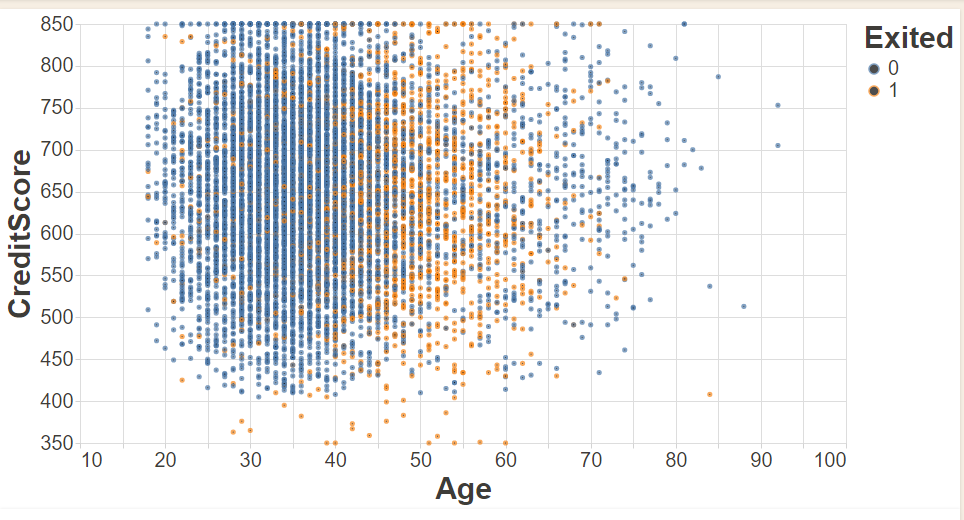
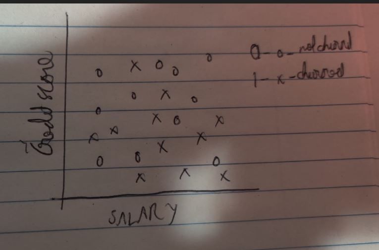
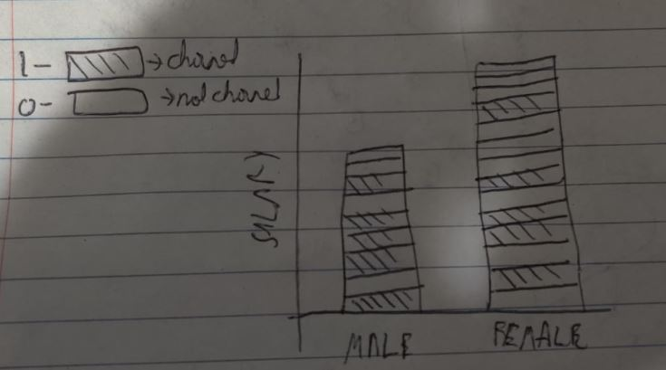

# Data Visualization Project

## Data

The data I propose to visualize for my project is the churn dataset found in [https://www.kaggle.com/shubh0799/churn-modelling]. I have createdd a gist of this dataset at
[https://gist.github.com/arjunrao796123/7c30f2b6d4a3a3746b0154260a7f46e8]. The dataset consists of 10000 data points which represent customers for a company. Each data point consists of details of the customer like CreditScore, Geography, Age,  Gender etc.. 

## Prototypes

I’ve created a proof of concept visualization of this data.

The image shows a compariosn between Age and Creditscore. The orange color indicates the customer has churned and the blue dot indicates that the customer has not churned.

## Questions & Tasks

The following tasks and questions will drive the visualization and interaction decisions for this project:

 * Which factors most influence churning of a customer?
 * Which country is responsible for less churning? Is there a specific reason for this?
 * Does the gender and salary affect churning of a customer?

## Sketches
Here are a couple of sketeches
* This image is a depiction of the credit score vs salary.
* We can study how churn is affected here and how these factors influence each other.
  - Since there are 10000 data points, I plan to bin the salaries based on a $10000 increments. 
* Usually low salary can lead to churn and I am hoping to see if the assumption is correct.
* A low credit score can also lead to churn as the customer is a regualr defaulter when it comes to payments and this can be a reason to churn.
* I plan to have a drop dorwn menu where we can view a range of salaries and credit scores.

* This image is a depiction of gender vs salary. 
* We can check if the customers are paid equally and on what basis a cusotmer of a certain gender churns.
  - The salary should be similar since salary should not be based on gender. There are a lot of issues these days regarding salary and I am hoping to see if this company is not     biased to a particular gender.
* I plan to have a drop down menu from where we can select a range of salaries. Binning will be done in order to reduce the number of data points.

* Since the dataset contains geographical data as well, it will be interesting to see how the company is performing all over the globe.
* I will have a drop down menu which will allow a choice of country
  - Once that is done, there will be a choice of features to display to understand how the feature is for that country.
* This can be used by the company to see where it is not performing well and can narrow down the features to pin point the problem.

## Schedule of Deliverables

* October 10
  - Bin the salaries and have the salaires part of the data ready to plot
  - October 13: Set the range of salaries in the graph for the drop down menu
* October 17
  - Plot the first visualization
  - October 19: Complete inclusion of the drop down menu
  - October 21: Ensure no errors in the code
* October 24
  - Plot the second visualization without any errors
  - October 26: Include the drop down menus and ensure no errors in the code
* October 30
  - Plot the third visualization
  - October 31: Have the drop down of countries ready for display
  - November 1: Include the features in the drop down menu and have no errors 
* November 4
  - Finalize and implement any inputs provided to make the visualization appealing.

## Visualizations

* Plot 1
  - It does binning of the data in order to represent 10000 data points
  - The number of bins chosen for this was 150 as it seemed to accomodate all the values
  - Instead of having a fixed choice of salary, it allows choice of salary range as well as a sliding window.
  - The Y axis represents the creditscore
  
 

* Plot 2 
  - This plot is built upon the previous visualization integrating the gender and countries as menus
  - The number of bins chosen for this was 150 as it seemed to accomodate all the values
  - It displays Gender as an option between male and female
  - The countries available is a part of the drop down menu
  - An interesting obsevation is that in Germany, females are churning more than in any other country. It would be interesting to know the exact reason for this.
  - France and spain seem to be major clients for this company.

 

* Plot 3
  - A display of gender vs salaries
  - Sliding across the salray range, it shows the selected customers that fit the filter value
  
 

## Future Work

  * Include number of bins as a choice (Plot 1 and Plot 2)
  * Include other features as a choice (Plot 1 and Plot 2)
  
